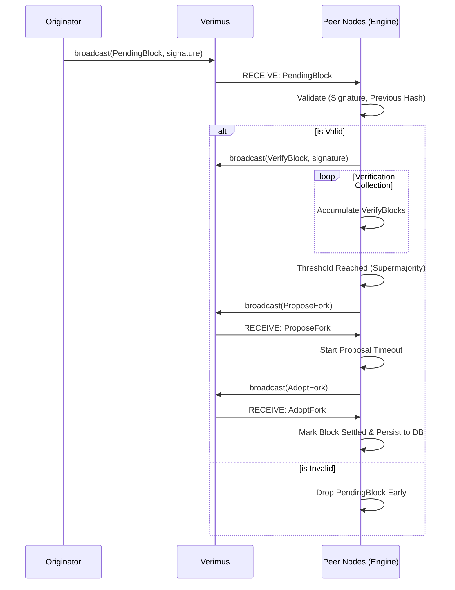

# Consensus Flow: Pending to Settled

This diagram explains the custom agreement protocol executed via the WebSocket mesh after a new block originates from any node. 

```mermaid
sequenceDiagram
    participant Originator
    participant Verimus
    participant Peer Nodes (Engine)
    
    Originator->>Verimus: broadcast(PendingBlock, signature)
    Verimus->>Peer Nodes (Engine): RECEIVE: PendingBlock
    
    Peer Nodes (Engine)->>Peer Nodes (Engine): Validate (Signature, Previous Hash)
    
    alt is Valid
        Peer Nodes (Engine)->>Verimus: broadcast(VerifyBlock, signature)
        
        loop Verification Collection
            Peer Nodes (Engine)->>Peer Nodes (Engine): Accumulate VerifyBlocks
        end
        
        Peer Nodes (Engine)->>Peer Nodes (Engine): Threshold Reached (Supermajority)
        Peer Nodes (Engine)->>Verimus: broadcast(ProposeFork)
        
        Verimus->>Peer Nodes (Engine): RECEIVE: ProposeFork
        Peer Nodes (Engine)->>Peer Nodes (Engine): Start Proposal Timeout

        Peer Nodes (Engine)->>Verimus: broadcast(AdoptFork)
        Verimus->>Peer Nodes (Engine): RECEIVE: AdoptFork
        
        Peer Nodes (Engine)->>Peer Nodes (Engine): Mark Block Settled & Persist to DB
    else is Invalid
        Peer Nodes (Engine)->>Peer Nodes (Engine): Drop PendingBlock Early
    end
```
