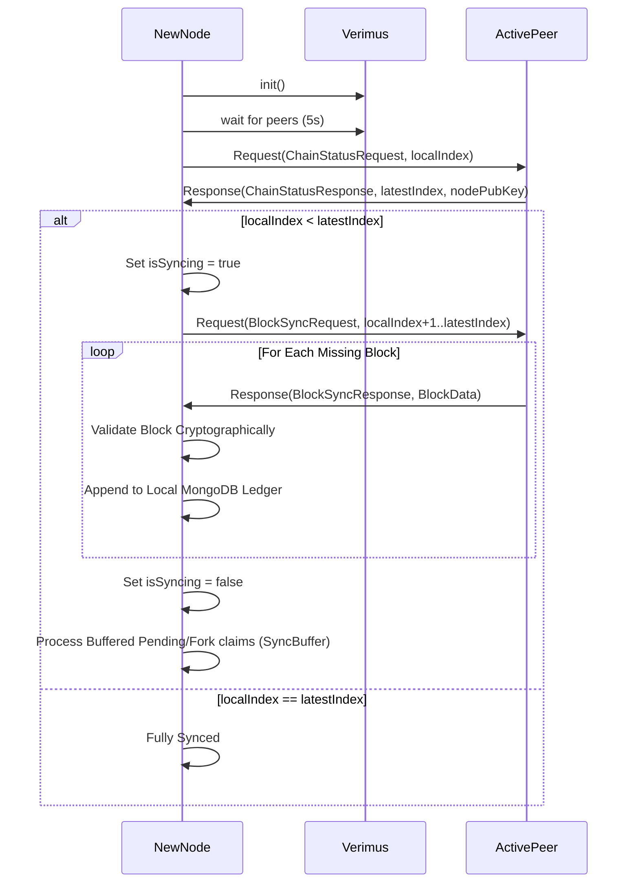

# Chain Synchronization Protocol

This diagram shows how a node seamlessly re-enters the network, compares index parity with an active node, and drains historical ledgers securely before transitioning live.

